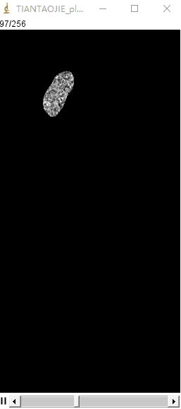
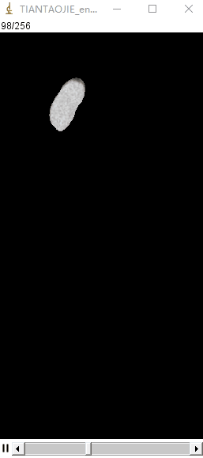
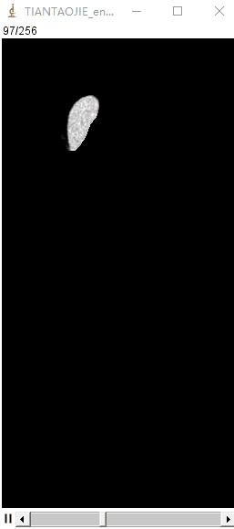
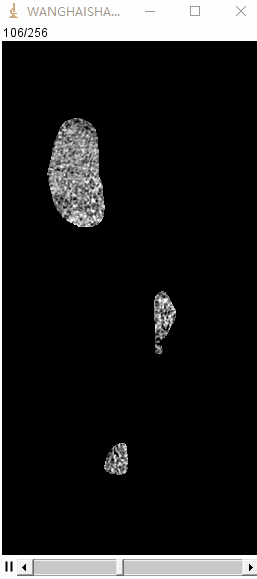
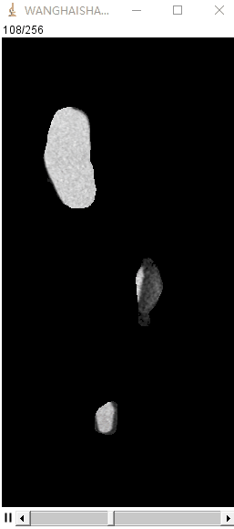
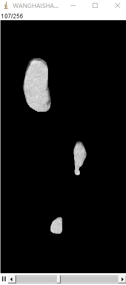
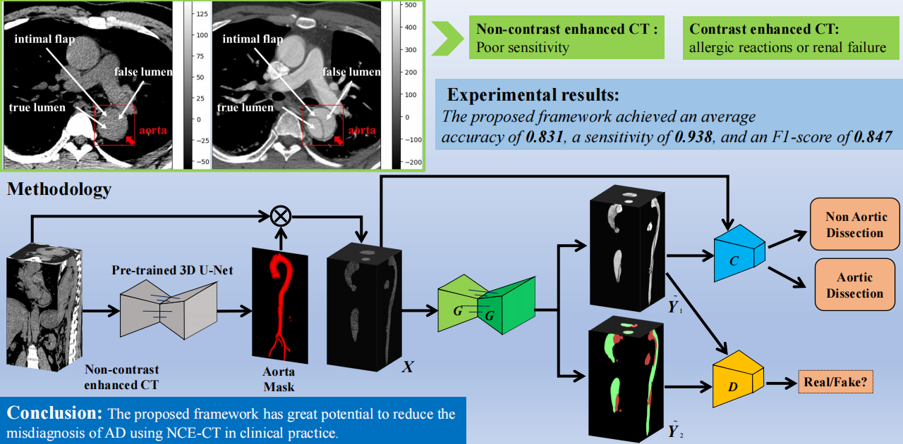

**#--------------------Normal--------------------##---------------------- AD----------------------#**


<p align='left'>
  
  
  
  
  
  
</p>

**[Input NCE-CT] | [Real CE-CT] | [Fake CE-CT] & [Input NCE-CT] | [Real CE-CT] | [Fake CE-CT]**

# Multi-task Generative Architecture (MTGA) in PyTorch

We provide PyTorch implementations for Multi-task Generative Architecture.

The code was inspired by [Pix2pix](https://github.com/junyanz) and modified to MTGA [Xiang-Yu Xiong](https://github.com/yXiangXiong).

**Note**: The current software works well with PyTorch 1.4.0+. Check out the older [branch](https://github.com/junyanz/pytorch-CycleGAN-and-pix2pix/tree/pytorch0.3.1) that supports PyTorch 0.4.

You may find useful information in [training/test tips](docs/tips.md) and [frequently asked questions](docs/qa.md).

**A Cascaded multi-task generative framework (CMTGF) for Aortic Dissection Detection: [Paper](https://ieeexplore.ieee.org/document/9827558)**

The 3D U-Net was a older nnU-Net created by [FabianIsensee](https://github.com/yXiangXiong/nnUNet), it was used to segment aortic mask from NCE-CT.

The folloiwing 3D MTGA was created by [Xiang-Yu Xiong](https://github.com/yXiangXiong), it contains a generator, a discriminator and a classifier.



## Prerequisites
- Linux or Windows (Pycharm + Anaconda)
- Python 2 or 3
- CPU or NVIDIA GPU + CUDA CuDNN

## Getting Started
### Installation
- Install PyTorch 1.4.0+ and torchvision from http://pytorch.org and other dependencies (e.g., [visdom](https://github.com/facebookresearch/visdom) and [dominate](https://github.com/Knio/dominate)). You can install all the dependencies by
```bash
pip install -r requirements.txt
```
- Clone this repo:
```bash
git clone https://github.com/yXiangXiong/CMTGF
cd CMTGF
```
- For Anaconda users, you can use pip to install PyTorch and other libraries.

### MTGA train/test
- Download a pix2pix dataset (e.g.facades):
```bash
bash ./datasets/download_pix2pix_dataset.sh facades
```
- Train the MTGA:
```
python train.py --dataroot D:\...\Random_AorticData --name aortas_nce2ce --model paired_pix2pix3d --netC CNN_3D --dataset_mode aligned --input_nc 1 --output_nc 2 --gpu_ids 0 --batch_size 1 --netG unet_256 --no_html --pool_size 0 --norm batch --no_flip --print_freq 10 --lambda_C 1 --lambda_L1 200 --display_id -1
```
- Test the MTGA:
```
python test.py --dataroot D:\...\Random_AorticData --name aortas_nce2ce --netC CNN_3D --model paired_pix2pix3d --netG unet_256 --dataset_mode aligned --input_nc 1 --output_nc 2 --norm batch --gpu_ids 0 --how_many 32 --eval --which_epoch 200
```

## [Datasets]
create  directory below and add your own datasets.
```
Random_AorticData：
|─trainA
│      001_plain.nii.gz # non-contrast enhanced images of aorta
│      002_plain.nii.gz
│      003_plain.nii.gz
│      ...
│      
├─trainB
│      001_enhance.nii.gz # contrast enhanced images of aorta
│      002_enhance.nii.gz
│      003_enhance.nii.gz
│      ...
│      
├─trainC
│      001_aorta.nii.gz # annotated true and false lumen masks by radiologists
│      002_aorta.nii.gz
│      003_aorta.nii.gz
│      ...
│      
├─testA
│      004_plain.nii.gz # non-contrast enhanced images of aorta
│      005_plain.nii.gz
│      ...
│      
├─testB
│      004_enhance.nii.gz # contrast enhanced images of aorta
│      005_enhance.nii.gz
│      ...
│      
├─testC
│      004_aorta.nii.gz # annotated true and false lumen masks by radiologists
│      005_aorta.nii.gz
│      ...
│      
└─ground_truth_classification.csv
# csv file has two columes: first is xxx.plain.nii.gz and second is 0/1. 0 mean normal and 1 mean aortic dissection.
```

## [Training/Test Tips](docs/tips.md)
Best practice for training and testing your models.

## Citation
If you are interested in this project and use this code for your research, please cite our papers.
```
@inproceedings{xiong2021CDLF,
  author    = {Xiangyu Xiong, Xiuhong Guan, Chuanqi Sun, Tianjing Zhang, Hao Chen, Yan Ding, Zhangbo Cheng, Lei Zhao, Xiaohai Ma, Guoxi Xie},
  title     = {A Cascaded Deep Learning Framework for Detecting Aortic Dissection
               Using Non-contrast Enhanced Computed Tomography},
  booktitle = {43rd Annual International Conference of the {IEEE} Engineering in
               Medicine {\&} Biology Society, {EMBC} 2021, Mexico, November 1-5,
               2021},
  year      = {2021},
}

@ARTICLE{xiong2022CMTGF,
  author={Xiong, Xiangyu and Ding, Yan and Sun, Chuanqi and Zhang, Zhuoneng and Guan, Xiuhong and Zhang, Tianjing and Chen, Hao and Liu, Hongyan and Cheng, Zhangbo and Zhao, Lei and Ma, Xiaohai and Xie, Guoxi},
  journal={IEEE Journal of Biomedical and Health Informatics}, 
  title={A Cascaded Multi-Task Generative Framework for Detecting Aortic Dissection on 3D Non-contrast-enhanced Computed Tomography},
  year={2022}
}
```


## Related Projects
**[CycleGAN-Torch](https://github.com/junyanz/CycleGAN) |
[pix2pixHD](https://github.com/NVIDIA/pix2pixHD) |
[EC-GAN](https://github.com/ayaanzhaque/EC-GAN) |
[BicycleGAN](https://github.com/junyanz/BicycleGAN)**

## Aortic Dissection Detection (Non-contrast Enhanced CT) Papers Collection
2022 Frontiers in Cardiovascular Medicine. [Advanced Warning of Aortic Dissection on Non-Contrast CT: The Combination of Deep Learning and Morphological Characteristics](https://www.frontiersin.org/articles/10.3389/fcvm.2021.762958/full).

2021 IEEE EMBC. [A Cascaded Deep Learning Framework for Detecting Aortic Dissection Using
Non-contrast Enhanced Computed Tomography](https://www.researchgate.net/publication/356933870_A_Cascaded_Deep_Learning_Framework_for_Detecting_Aortic_Dissection_Using_Non-contrast_Enhanced_Computed_Tomography).

2020 Medical Image Analysis. [Detection, segmentation, simulation and visualization of aortic dissections: A review](https://www.tugraz.at/fileadmin/user_upload/tugrazExternal/c7625f78-a8e9-46f3-a92b-e09b4c328341/publication/Pepe_et_al__2020_.pdf).

2020 European Radiology. [Deep learning algorithm for detection of aortic dissection on non-contrast-enhanced CT](https://link.springer.com/article/10.1007/s00330-020-07213-w).
## Acknowledgments
Our code is inspired by [pytorch-pix2pix](https://github.com/junyanz/pytorch-CycleGAN-and-pix2pix).
