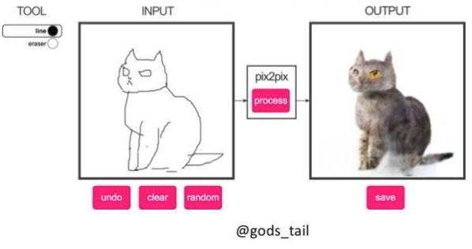

<br><br><br>

# CycleGAN and pix2pix in PyTorch

We provide PyTorch implementations for both unpaired and paired image-to-image translation.

The code was written by [Jun-Yan Zhu](https://github.com/junyanz) and [Taesung Park](https://github.com/taesung89), and supported by [Tongzhou Wang](https://ssnl.github.io/).

This PyTorch implementation produces results comparable to or better than our original Torch software. If you would like to reproduce the same results as in the papers, check out the original [CycleGAN Torch](https://github.com/junyanz/CycleGAN) and [pix2pix Torch](https://github.com/phillipi/pix2pix) code

**Note**: The current software works well with PyTorch 0.4+. Check out the older [branch](https://github.com/junyanz/pytorch-CycleGAN-and-pix2pix/tree/pytorch0.3.1) that supports PyTorch 0.1-0.3.

You may find useful information in [training/test tips](docs/tips.md) and [frequently asked questions](docs/qa.md).

**CycleGAN: [Project](https://junyanz.github.io/CycleGAN/) |  [Paper](https://arxiv.org/pdf/1703.10593.pdf) |  [Torch](https://github.com/junyanz/CycleGAN)**


**Pix2pix:  [Project](https://phillipi.github.io/pix2pix/) |  [Paper](https://arxiv.org/pdf/1611.07004.pdf) |  [Torch](https://github.com/phillipi/pix2pix)**


**[EdgesCats Demo](https://affinelayer.com/pixsrv/) | [pix2pix-tensorflow](https://github.com/affinelayer/pix2pix-tensorflow) | by [Christopher Hesse](https://twitter.com/christophrhesse)**



If you use this code for your research, please cite:

Unpaired Image-to-Image Translation using Cycle-Consistent Adversarial Networks
[Jun-Yan Zhu](https://people.eecs.berkeley.edu/~junyanz/)\*,  [Taesung Park](https://taesung.me/)\*, [Phillip Isola](https://people.eecs.berkeley.edu/~isola/), [Alexei A. Efros](https://people.eecs.berkeley.edu/~efros)
In ICCV 2017. (* equal contributions) [[Bibtex]](https://junyanz.github.io/CycleGAN/CycleGAN.txt)


Image-to-Image Translation with Conditional Adversarial Networks
[Phillip Isola](https://people.eecs.berkeley.edu/~isola), [Jun-Yan Zhu](https://people.eecs.berkeley.edu/~junyanz), [Tinghui Zhou](https://people.eecs.berkeley.edu/~tinghuiz), [Alexei A. Efros](https://people.eecs.berkeley.edu/~efros)
In CVPR 2017. [[Bibtex]](http://people.csail.mit.edu/junyanz/projects/pix2pix/pix2pix.bib)

## Course
CycleGAN course assignment [code](http://www.cs.toronto.edu/~rgrosse/courses/csc321_2018/assignments/a4-code.zip) and [handout](http://www.cs.toronto.edu/~rgrosse/courses/csc321_2018/assignments/a4-handout.pdf) designed by Prof. [Roger Grosse](http://www.cs.toronto.edu/~rgrosse/) for [CSC321](http://www.cs.toronto.edu/~rgrosse/courses/csc321_2018/) "Intro to Neural Networks and Machine Learning" at University of Toronto. Please contact the instructor if you would like to adopt it in your course.

## Other implementations
### CycleGAN
<p><a href="https://github.com/leehomyc/cyclegan-1"> [Tensorflow]</a> (by Harry Yang),
<a href="https://github.com/architrathore/CycleGAN/">[Tensorflow]</a> (by Archit Rathore),
<a href="https://github.com/vanhuyz/CycleGAN-TensorFlow">[Tensorflow]</a> (by Van Huy),
<a href="https://github.com/XHUJOY/CycleGAN-tensorflow">[Tensorflow]</a> (by Xiaowei Hu),
<a href="https://github.com/LynnHo/CycleGAN-Tensorflow-Simple"> [Tensorflow-simple]</a> (by Zhenliang He),
<a href="https://github.com/luoxier/CycleGAN_Tensorlayer"> [TensorLayer]</a> (by luoxier),
<a href="https://github.com/Aixile/chainer-cyclegan">[Chainer]</a> (by Yanghua Jin),
<a href="https://github.com/yunjey/mnist-svhn-transfer">[Minimal PyTorch]</a> (by yunjey),
<a href="https://github.com/Ldpe2G/DeepLearningForFun/tree/master/Mxnet-Scala/CycleGAN">[Mxnet]</a> (by Ldpe2G),
<a href="https://github.com/tjwei/GANotebooks">[lasagne/keras]</a> (by tjwei)</p>
</ul>

### pix2pix
<p><a href="https://github.com/affinelayer/pix2pix-tensorflow"> [Tensorflow]</a> (by Christopher Hesse),
<a href="https://github.com/Eyyub/tensorflow-pix2pix">[Tensorflow]</a> (by Eyyüb Sariu),
<a href="https://github.com/datitran/face2face-demo"> [Tensorflow (face2face)]</a> (by Dat Tran),
<a href="https://github.com/awjuliani/Pix2Pix-Film"> [Tensorflow (film)]</a> (by Arthur Juliani),
<a href="https://github.com/kaonashi-tyc/zi2zi">[Tensorflow (zi2zi)]</a> (by Yuchen Tian),
<a href="https://github.com/pfnet-research/chainer-pix2pix">[Chainer]</a> (by mattya),
<a href="https://github.com/tjwei/GANotebooks">[tf/torch/keras/lasagne]</a> (by tjwei),
<a href="https://github.com/taey16/pix2pixBEGAN.pytorch">[Pytorch]</a> (by taey16)
</p>
</ul>

## Prerequisites
- Linux or macOS
- Python 2 or 3
- CPU or NVIDIA GPU + CUDA CuDNN

## Getting Started
### Installation
- Install PyTorch 1.4.0+ and torchvision from http://pytorch.org and other dependencies (e.g., [visdom](https://github.com/facebookresearch/visdom) and [dominate](https://github.com/Knio/dominate)). You can install all the dependencies by
```bash
pip install -r requirements.txt
```
- Clone this repo:
```bash
git clone https://github.com/junyanz/pytorch-CycleGAN-and-pix2pix
cd pytorch-CycleGAN-and-pix2pix
```
- For Conda users, we include a script `./scripts/conda_deps.sh` to install PyTorch and other libraries.

### CycleGAN train/test
- Download a CycleGAN dataset (e.g. maps):
```bash
bash ./datasets/download_cyclegan_dataset.sh maps
```
- Train a model:
```bash
#!./scripts/train_cyclegan.sh
python train.py --dataroot ./datasets/maps --name maps_cyclegan --model cycle_gan
```
- To view training results and loss plots, run `python -m visdom.server` and click the URL http://localhost:8097. To see more intermediate results, check out `./checkpoints/maps_cyclegan/web/index.html`
- Test the model:
```bash
#!./scripts/test_cyclegan.sh
python test.py --dataroot ./datasets/maps --name maps_cyclegan --model cycle_gan
```
The test results will be saved to a html file here: `./results/maps_cyclegan/latest_test/index.html`.

### pix2pix train/test
- Download a pix2pix dataset (e.g.facades):
```bash
bash ./datasets/download_pix2pix_dataset.sh facades
```
- Train a model:
```bash
#!./scripts/train_pix2pix.sh
python train.py --dataroot ./datasets/facades --name facades_pix2pix --model pix2pix --which_direction BtoA
```
- To view training results and loss plots, run `python -m visdom.server` and click the URL http://localhost:8097. To see more intermediate results, check out  `./checkpoints/facades_pix2pix/web/index.html`
- Test the model (`bash ./scripts/test_pix2pix.sh`):
```bash
#!./scripts/test_pix2pix.sh
python test.py --dataroot ./datasets/facades --name facades_pix2pix --model pix2pix --which_direction BtoA
```
The test results will be saved to a html file here: `./results/facades_pix2pix/test_latest/index.html`.

You can find more scripts at `scripts` directory.

### Apply a pre-trained model (CycleGAN)
- You can download a pretrained model (e.g. horse2zebra) with the following script:
```bash
bash ./scripts/download_cyclegan_model.sh horse2zebra
```
The pretrained model is saved at `./checkpoints/{name}_pretrained/latest_net_G.pth`. Check [here](https://github.com/junyanz/pytorch-CycleGAN-and-pix2pix/blob/master/scripts/download_cyclegan_model.sh#L3) for all the available CycleGAN models.
- To test the model, you also need to download the  horse2zebra dataset:
```bash
bash ./datasets/download_cyclegan_dataset.sh horse2zebra
```

- Then generate the results using
```bash
python test.py --dataroot datasets/horse2zebra/testA --name horse2zebra_pretrained --model test
```
The option `--model test` is used for generating results of CycleGAN only for one side. `python test.py --model cycle_gan` will require loading and generating results in both directions, which is sometimes unnecessary. The results will be saved at `./results/`. Use `--results_dir {directory_path_to_save_result}` to specify the results directory.

- If you would like to apply a pre-trained model to a collection of input images (rather than image pairs), please use `--dataset_mode single` and `--model test` options. Here is a script to apply a model to Facade label maps (stored in the directory `facades/testB`).
``` bash
#!./scripts/test_single.sh
python test.py --dataroot ./datasets/facades/testB/ --name {your_trained_model_name} --model test
```
You might want to specify `--netG` to match the generator architecture of the trained model.

### Apply a pre-trained model (pix2pix)

Download a pre-trained model with `./scripts/download_pix2pix_model.sh`.

- Check [here](https://github.com/junyanz/pytorch-CycleGAN-and-pix2pix/blob/master/scripts/download_pix2pix_model.sh#L3) for all the available pix2pix models. For example, if you would like to download label2photo model on the Facades dataset,
```bash
bash ./scripts/download_pix2pix_model.sh facades_label2photo
```
- Download the pix2pix facades datasets:
```bash
bash ./datasets/download_pix2pix_dataset.sh facades
```
- Then generate the results using
```bash
python test.py --dataroot ./datasets/facades/ --which_direction BtoA --model pix2pix --name facades_label2photo_pretrained
```
Note that we specified `--which_direction BtoA` as Facades dataset's A to B direction is photos to labels.

- See a list of currently available models at `./scripts/download_pix2pix_model.sh`

## [Datasets]
create  directory below and add your own datasets.
```
Random_AorticData：
|─trainA
│      001_plain.nii.gz # non-contrast enhanced images of aorta
│      002_plain.nii.gz
│      003_plain.nii.gz
│      ...
│      
├─trainB
│      001_enhance.nii.gz # contrast enhanced images of aorta
│      002_enhance.nii.gz
│      003_enhance.nii.gz
│      ...
│      
├─trainC
│      001_aorta.nii.gz # annotated true and false lumen masks by radiologists
│      002_aorta.nii.gz
│      003_aorta.nii.gz
│      ...
│      
├─testA
│      004_plain.nii.gz # non-contrast enhanced images of aorta
│      005_plain.nii.gz
│      ...
│      
├─testB
│      004_enhance.nii.gz # contrast enhanced images of aorta
│      005_enhance.nii.gz
│      ...
│      
├─testC
│      004_aorta.nii.gz # annotated true and false lumen masks by radiologists
│      005_aorta.nii.gz
│      ...
│      
└─ground_truth_classification.csv # two columes: first is xxx.plain.nii.gz and second is 0/1. 0 is normal and 1 is aortic dissection.
```

## [Training/Test Tips](docs/tips.md)
Best practice for training and testing your models.

## Citation
If you are interested in this project and use this code for your research, please cite our papers.
```
@inproceedings{xiong2021CDLF,
  author    = {vXiangyu Xiong, Xiuhong Guan, Chuanqi Sun, Tianjing Zhang, Hao Chen, Yan Ding, Zhangbo Cheng, Lei Zhao, Xiaohai Ma, Guoxi Xie},
  title     = {A Cascaded Deep Learning Framework for Detecting Aortic Dissection
               Using Non-contrast Enhanced Computed Tomography},
  booktitle = {43rd Annual International Conference of the {IEEE} Engineering in
               Medicine {\&} Biology Society, {EMBC} 2021, Mexico, November 1-5,
               2021},
  year      = {2021},
}

@ARTICLE{xiong2022CMTGF,
  author={Xiong, Xiangyu and Ding, Yan and Sun, Chuanqi and Zhang, Zhuoneng and Guan, Xiuhong and Zhang, Tianjing and Chen, Hao and Liu, Hongyan and Cheng, Zhangbo and Zhao, Lei and Ma, Xiaohai and Xie, Guoxi},
  journal={IEEE Journal of Biomedical and Health Informatics}, 
  title={A Cascaded Multi-Task Generative Framework for Detecting Aortic Dissection on 3D Non-contrast-enhanced Computed Tomography},
  year={2022}
}
```


## Related Projects
**[CycleGAN-Torch](https://github.com/junyanz/CycleGAN) |
[pix2pixHD](https://github.com/NVIDIA/pix2pixHD) |
[EC-GAN](https://github.com/ayaanzhaque/EC-GAN) |
[BicycleGAN](https://github.com/junyanz/BicycleGAN)**

## Aortic Dissection Detection (Non-contrast Enhanced CT) Papers Collection
2022 Frontiers in Cardiovascular Medicine. [Advanced Warning of Aortic Dissection on Non-Contrast CT: The Combination of Deep Learning and Morphological Characteristics](https://www.frontiersin.org/articles/10.3389/fcvm.2021.762958/full).

2021 IEEE EMBC. [A Cascaded Deep Learning Framework for Detecting Aortic Dissection Using
Non-contrast Enhanced Computed Tomography](https://www.researchgate.net/publication/356933870_A_Cascaded_Deep_Learning_Framework_for_Detecting_Aortic_Dissection_Using_Non-contrast_Enhanced_Computed_Tomography).

2020 Medical Image Analysis. [Detection, segmentation, simulation and visualization of aortic dissections: A review](https://www.tugraz.at/fileadmin/user_upload/tugrazExternal/c7625f78-a8e9-46f3-a92b-e09b4c328341/publication/Pepe_et_al__2020_.pdf).

2020 European Radiology. [Deep learning algorithm for detection of aortic dissection on non-contrast-enhanced CT](https://link.springer.com/article/10.1007/s00330-020-07213-w).
## Acknowledgments
Our code is inspired by [pytorch-pix2pix](https://github.com/junyanz/pytorch-CycleGAN-and-pix2pix).
